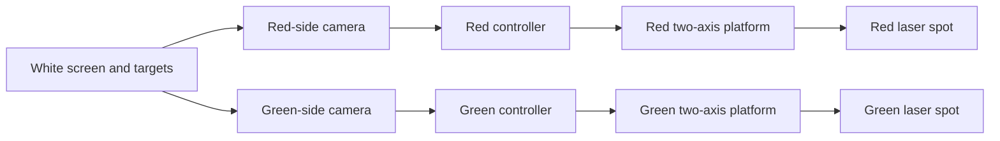
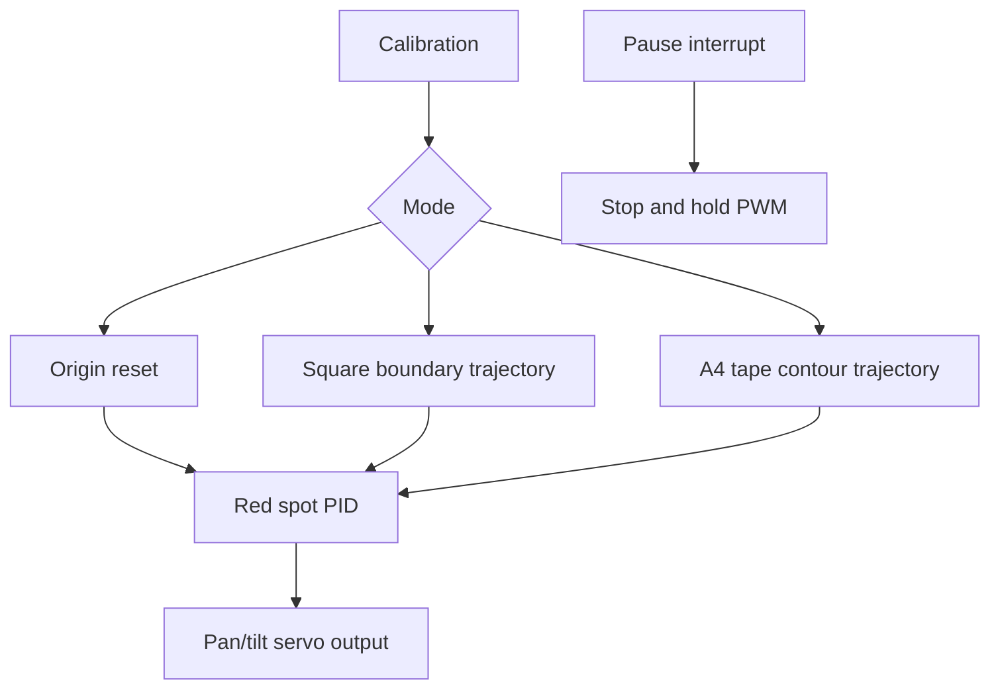
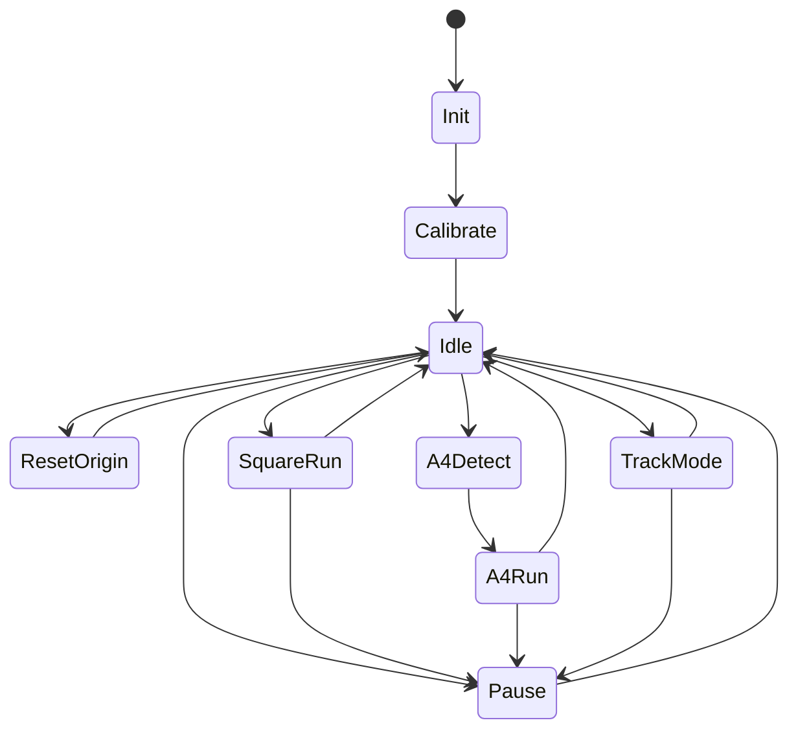

# Validation Example: NUEDC 2023 E 题 Award-Level Workflow

Source problem: https://nuedc.org/problems/2023_E%E9%A2%98_%E8%BF%90%E5%8A%A8%E7%9B%AE%E6%A0%87%E6%8E%A7%E5%88%B6%E4%B8%8E%E8%87%AA%E5%8A%A8%E8%BF%BD%E8%B8%AA%E7%B3%BB%E7%BB%9F.pdf

This file is a validation artifact for the skill. It shows the expected depth of a full-process answer. It is not a completed physical measurement report; all data rows marked `待实测` must be replaced by real measurements.

## 1. 赛题拆解与需求矩阵

Task summary: build a two-laser motion-target and automatic-tracking system. A red spot simulates the moving target on a white screen. A green spot tracks the red spot from an independent two-axis platform. The two systems must be independent and cannot communicate.

| ID | Type | Requirement | Metric | Test condition | Priority | Main risk | Design response |
|---|---|---|---|---|---|---|---|
| B1 | Basic | Red spot reset to screen origin | distance to origin <= 2 cm | arbitrary starting position | P0 | coordinate calibration and backlash | homing/calibration map plus closed-loop spot detection |
| B2 | Basic | Red spot moves clockwise around square boundary | one lap <= 30 s, distance to line <= 2 cm | 0.5 m square on screen | P0 | trajectory mapping from angle to screen coordinates | inverse projection table plus line-following trajectory planner |
| B3 | Basic | Red spot moves around A4 tape rectangle | one lap <= 30 s, do not leave tape | A4 target at chosen position | P0 | target localization and rotated rectangle detection | camera detects black tape rectangle, planner generates four edges |
| B4 | Basic | Same as B3 after arbitrary rotation | one lap <= 30 s | rotated A4 target | P0 | perspective and angle estimation | image threshold + contour detection + ordered corner extraction |
| F1 | Advanced | Green spot tracks after one-key start | lock within 2 s, spot distance <= 3 cm | red target reset state | P1 | no communication; green must visually observe red | independent vision loop on green controller |
| F2 | Advanced | Green tracks red during B3/B4 motion | failures penalized if distance > 3 cm | green platform placed anywhere on allowed line | P1 | field-of-view, occlusion, servo latency | wide-angle camera, feedforward prediction, high-rate PID |
| F3 | Advanced | Pause keys stop both spots for measurement | immediate braking | judge measures two-spot distance | P1 | overshoot after pause | interrupt-level stop and PWM hold |
| O1 | Other | Extra robustness | stable under lighting and placement changes | unknown | P2 | overfitting | exposure lock, color threshold calibration, repeated trials |

Score strategy: B1-B4 are non-negotiable. F2 carries high value, but it depends on B3/B4 and independent green vision. Freeze extra polish if B3/B4 are not stable by the midpoint.

## 2. 题型诊断与省级一等奖水平关键风险

Topic type: motion control, embedded vision, two-axis servo platform, coordinate calibration, real-time tracking.

Award-level risk list:

| Risk | Why it matters | Control method |
|---|---|---|
| Screen-coordinate calibration | All line distance metrics depend on mapping accuracy | four-point calibration, origin check, saved coefficients |
| Rotated A4 detection | B4 and advanced tracking depend on robust contour detection | threshold black tape, contour area filtering, corner ordering |
| Servo backlash and nonlinearity | spot may leave boundary during turns | slow corner approach, PID deadband compensation |
| Independent tracking constraint | green cannot receive red coordinates | separate green camera and vision algorithm |
| Lighting variation | red/green/black thresholds drift | calibration page, exposure lock, HSV thresholds |
| Test repeatability | ranking depends on stable repeated runs | rehearsal script and repeated-trial table |

## 3. 方案论证

| Dimension | 方案一: open-loop angle table | 方案二: red platform vision closed loop + green independent vision | 方案三: mechanical drawing arm/XY gantry |
|---|---|---|---|
| Core idea | map desired screen points to servo angles | camera observes screen and closes loop on actual spot position | use XY mechanism to move laser or mirror |
| Metric potential | medium for fixed square, weak for rotated A4 | high for all basic and advanced items | high geometry accuracy but slower build |
| Stability | sensitive to placement and backlash | robust after calibration | mechanically stable if built well |
| Debug speed | fast start, hard to polish | moderate, module tests clear | slow mechanical build |
| Component availability | high | high: MCU/SBC/camera/servos | depends on rails, sliders, motor drivers |
| Test reproducibility | weak after screen movement | strong if calibration saved | strong but bulky |
| Main risk | B4 and F2 likely unstable | vision latency and tuning | time, size, mechanical precision |
| Recommendation | backup only | recommended | reject for time risk |

Final choice: choose 方案二. It balances metric potential, debugging isolation, and judge-test reproducibility. 方案一 can pass partial basic items quickly but has poor tolerance for arbitrary A4 placement. 方案三 has precision potential but consumes too much mechanical time.

## 4. 系统总体架构

Signal flow:

Control flow:

Power flow:

- 5 V rail: servos and laser modules. Estimate peak servo current before choosing regulator.
- 3.3 V rail: MCU/camera module if needed.
- Separate servo power return from vision/MCU ground star point to reduce brownout.
- Add reverse polarity protection, fuse or current-limit module, and local bulk capacitor near servos.

Debug flow:

- Red controller serial log: mode, target coordinate, detected red coordinate, error, servo PWM.
- Green controller serial log: detected red coordinate, detected green coordinate, distance, tracking state.
- Test points: 5 V rail, 3.3 V rail, servo PWM, laser enable, pause key.
- Calibration file: screen corners, origin, HSV thresholds, servo neutral values.

## 5. 模块设计卡

| Module | Requirement served | Input | Output | Key parts | Key parameters | Risk | Debug method | Report evidence |
|---|---|---|---|---|---|---|---|---|
| Screen calibration | B1-B4, F2 | camera image | pixel-to-screen transform | camera, calibration marks | homography or affine map | perspective error | mark four screen corners and verify origin | calibration table |
| Red spot control | B1-B4 | desired coordinate, detected spot | servo PWM | MCU, two servos, red laser | loop period 20-50 ms | backlash and overshoot | step response test | error-vs-time table |
| A4 contour detection | B3-B4 | camera image | ordered rectangle corners | camera, image algorithm | threshold, contour area | lighting and false edges | rotate target and detect corners | detection success table |
| Green tracking | F1-F2 | independent camera image | green servo PWM | second controller, camera, green laser | lock time <= 2 s | red/green separation | distance log every 100 ms | tracking distance table |
| Pause and safety | F3 | key input | immediate hold | GPIO interrupt, laser enable | response time | debounce/latency | oscilloscope or log timestamp | pause response table |
| Power module | all | battery/DC supply | 5 V/3.3 V rails | buck converter, capacitors, fuse | peak current margin | servo dip resets MCU | load transient test | rail voltage table |

## 6. 硬件设计 Plan

| Module | Circuit/device | Selection reason | Alternative | Protection/reliability | Test point |
|---|---|---|---|---|---|
| Controller | STM32/ESP32-class controller or camera-capable embedded board | timers, PWM, camera/serial support | OpenMV-like vision board | watchdog and saved calibration | UART TX/RX |
| Vision | camera observing full screen | detects red, green, black tape without inter-system communication | line sensor not suitable for arbitrary target | fixed mount and exposure lock | image debug output |
| Pan/tilt | two-axis servo or gimbal | simple mechanical control | stepper with mirror | current margin and mechanical limit | PWM signal |
| Laser | red and green low-power modules | spot target visible | LED pointer not focused | laser safety and enable control | laser enable voltage |
| Power | 5 V high-current buck + 3.3 V regulator | servo current isolation | USB power not robust | fuse/current limit, bulk capacitor | rail voltage |

Hardware notes:

- Put the camera rigidly relative to the screen. Moving camera mounts destroy calibration.
- Keep the laser spot diameter under the required limit by focusing and verifying at 1 m.
- Add physical angle limits to prevent the laser leaving the safe screen area.
- Keep the two control systems electrically and logically independent except for sharing the screen as the observed environment.

## 7. 软件与算法设计 Plan

| Function | Trigger/period | Input | Output | Key parameter | Debug output |
|---|---|---|---|---|---|
| calibration_load | startup | stored data | transform coefficients | checksum | coefficients |
| color_threshold | each frame | RGB/HSV image | red/green/black masks | HSV thresholds | mask area |
| spot_centroid | each frame | color mask | spot center | min/max blob area | pixel coordinate |
| rectangle_detect | setup/B3/B4 | black mask | A4 corners | contour area and angle | corner list |
| trajectory_generator | 20-50 ms | mode and target path | desired screen coordinate | lap time 30 s | target coordinate |
| pid_update | 20 ms | desired and measured coordinate | servo PWM | Kp/Ki/Kd/deadband | error and PWM |
| green_tracker | 20-50 ms | red and green spot centers | servo PWM | lock threshold 3 cm | distance |
| pause_handler | interrupt | key state | hold PWM | debounce time | pause timestamp |

State machine:

Algorithm details:

- Red side detects its own red spot and closes the loop to planned coordinates.
- For B3/B4, detect the black-tape rectangle, order four corners clockwise, then interpolate line segments.
- Green side detects both red and green spots in its own camera image and closes the loop to minimize distance.
- Tracking success is declared only after distance remains under threshold for a short debounce window, then continuous sound/light prompt turns on.

## 8. 理论分析与关键参数计算

| Metric need | Formula | Substitution | Result | Design decision | Verification |
|---|---|---|---|---|---|
| Convert cm error to pixel error | `pixel_per_cm = image_width / screen_width_cm` | e.g. 640 px / 60 cm | about 10.7 px/cm | 2 cm allows about 21 px, 3 cm allows about 32 px | calibration grid test |
| Lap speed for 0.5 m square | `v = perimeter / time` | 2 m / 30 s | 6.67 cm/s | target step should be small enough for smooth servo tracking | timed square run |
| A4 tape path speed | `v = 2(L+W)/30` | A4 about 29.7 cm x 21 cm | about 3.38 cm/s | easier than square speed; prioritize corner handling | timed A4 run |
| Servo update period | `T <= allowed_error / max_speed` | 2 cm / 6.67 cm/s | <= 0.30 s | choose 20-50 ms loop period for margin | log timestamps |
| Green lock time | `settling_time <= 2 s` | tracking threshold 3 cm | controller must settle in under 2 s | tune PID from slow to fast, limit overshoot | step tracking test |
| Power margin | `I_supply >= I_mcu + 2*I_servo_peak + margin` | actual servo current待测 | 待计算 | choose regulator after stall-current measurement | load transient test |

The numbers above are planning estimates. Physical measurement and final geometry must replace assumptions.

## 9. 分阶段调试计划

| Stage | Goal | Method | Pass standard | Record |
|---|---|---|---|---|
| Unit power-on | stable rails and no overheating | power each subsystem with current limit | no reset, rail within tolerance | voltage/current table |
| Servo mapping | verify pan/tilt movement | command PWM sweep and mark spot coordinates | no stuck zones, repeatable position | angle-coordinate table |
| Vision threshold | detect red, green, and black tape | vary lighting and target position | stable centroid/corners | detection success table |
| Red closed loop | move to fixed points | command origin and four corners | error <= 2 cm after settling | coordinate error table |
| Square path | run boundary path | time one lap and sample error | <= 30 s and line error <= 2 cm | path error table |
| A4 path | detect and trace tape rectangle | test multiple positions/rotations | no complete tape departure | repeated run table |
| Green tracking | independent tracking | start from reset and moving path | lock <= 2 s, distance <= 3 cm | tracking distance log |
| Pause test | stop both systems | press pause during motion | immediate hold for measurement | response-time table |
| Pre-judge rehearsal | exact scoring sequence | run B1-B4 and F1-F2 in order | stable repeated pass | final rehearsal sheet |

Debug log template:

| Time | Stage | Symptom | Hypothesis | Test | Result | Change | Next step |
|---|---|---|---|---|---|---|---|
| 待填写 | A4 path | corner overshoot | PID too aggressive | reduce Kp and add corner slowdown | 待实测 | 待填写 | repeat rotated target |

## 10. 测试证据矩阵

| Requirement | Instrument | Setup | Procedure | Data table | Pass/fail rule |
|---|---|---|---|---|---|
| B1 reset | ruler or calibrated image grid | spot at arbitrary positions | press reset and measure distance to origin | Table 1 | <= 2 cm |
| B2 square path | stopwatch, screen marks, camera log | 0.5 m square | run one lap and sample distance to line | Table 2 | <= 30 s and <= 2 cm |
| B3 A4 non-rotated | stopwatch, A4 tape target | target at chosen position | trace one lap | Table 3 | <= 30 s, no disqualifying departure |
| B4 A4 rotated | stopwatch, A4 tape target | random position and angle | trace one lap | Table 4 | same as B3 |
| F1 lock | stopwatch, ruler/image log | red reset, green arbitrary allowed placement | one-key track | Table 5 | lock <= 2 s, distance <= 3 cm |
| F2 dynamic track | stopwatch, image log | B3/B4 repeated | track during motion | Table 6 | no long failure, minimize failures |
| F3 pause | log timestamp or oscilloscope | motion state | press pause | Table 7 | immediate hold |

Example data table format:

| Test no. | Requirement | Target/theory value | Measured value | Error | Pass | Notes |
|---|---|---|---|---|---|---|
| 1 | B1 | 0 cm from origin | 待实测 | 待计算 | 待判断 | start from upper-left |

## 11. 指标完成情况

| 题目要求 | 设计实现 | 测试项目 | 测试结果 | 误差/得分依据 | 是否满足 |
|---|---|---|---|---|---|
| B1 origin reset | red vision closed-loop origin command | reset distance measurement | 待实测 | <= 2 cm | 待判断 |
| B2 square boundary | calibrated square trajectory | timed square path | 待实测 | <= 30 s and <= 2 cm | 待判断 |
| B3 A4 rectangle | black-tape contour and edge interpolation | A4 path test | 待实测 | tape departure rule | 待判断 |
| B4 rotated A4 | rotated contour corner ordering | rotated A4 path test | 待实测 | same as B3 | 待判断 |
| F1 static tracking | green independent vision and PID | lock-time test | 待实测 | <= 2 s and <= 3 cm | 待判断 |
| F2 dynamic tracking | green tracks red from camera observation | moving-track distance log | 待实测 | failure count/duration | 待判断 |
| F3 pause | interrupt hold command | pause response test | 待实测 | immediate hold | 待判断 |

## 12. 设计报告提纲

1. 摘要: task, recommended dual-vision closed-loop scheme, key expected verification items, and pending measurement note.
2. 系统方案: compare open-loop table, dual-vision closed loop, and mechanical gantry; justify final scheme.
3. 理论分析与计算: coordinate mapping, path speed, loop period, tracking threshold, power margin.
4. 电路与程序设计: controllers, cameras, servos, lasers, power, state machine, PID, contour detection.
5. 系统调试: calibration, servo mapping, vision threshold, path test, tracking test.
6. 测试方案与测试结果: instruments, conditions, repeated-trial tables, metric fulfillment matrix.
7. 误差分析: calibration error, lens distortion, servo backlash, threshold drift, mechanical vibration.
8. 总结: completed items after real tests, limitations, and improvement plan.

## 13. Honest QA Review

Current validation quality:

- Full process coverage: yes, from requirement matrix to report outline.
- Reproducibility: strong enough to guide a build, but final component choices require actual lab inventory.
- Award-level target: the plan addresses high-score risks, especially independent green tracking and rotated A4 detection.
- Missing real data: all measurements are pending; no success claim is made.
- Main remaining engineering risks: camera mounting, lighting calibration, servo backlash, and real-time latency.
- Compliance: no outside live-contest assistance should be used during an active official contest unless current rules allow it.
