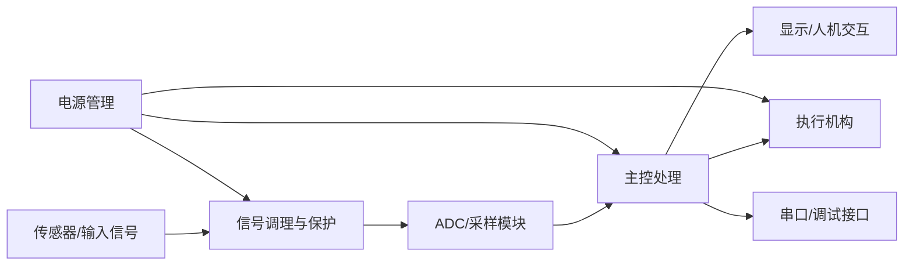

# Templates

Use these templates as building blocks. Fill unknown values with `待填写` instead of inventing data.

## Problem Analysis

```markdown
# 赛题解析

## 1. 题目目标
本题要求设计并制作……

## 2. 基本要求
| 序号 | 要求 | 指标 | 分值/权重 | 测试方式 | 难度 | 优先级 |
|---|---|---|---|---|---|---|
| 1 | 待填写 | 待填写 | 待填写 | 待填写 | 中 | P0 |

## 3. 发挥部分
| 序号 | 要求 | 指标 | 分值/权重 | 实现建议 | 风险 |
|---|---|---|---|---|---|

## 4. 关键约束
- 尺寸/重量：
- 供电：
- 元器件：
- 测试环境：
- 时间/调试条件：

## 5. 技术难点与优先级
1. ……
```

## Award-Level Full Workflow

Use this when the user wants a complete design assistance package.

```markdown
# 电赛全流程设计辅助包

## 1. 赛题拆解与需求矩阵
| ID | 类型 | 题目要求 | 指标/范围 | 测试条件 | 优先级 | 风险 | 设计响应 |
|---|---|---|---|---|---|---|---|
| B1 | 基本要求 | 待填写 | 待填写 | 待填写 | P0 | 待填写 | 待填写 |

## 2. 题型诊断与关键风险
- 题型：
- 关键得分点：
- 省级一等奖水平的主要风险：
- 必须优先完成的闭环：

## 3. 时间与评分策略
| 阶段 | 时间预算 | 目标 | 停止条件 |
|---|---:|---|---|
| 读题与定方案 | 0-4 h | 需求矩阵、最终方案 | 方案可测试 |
| 模块实现 | 4-24 h | P0 模块工作 | 单模块可测 |
| 系统集成 | 24-48 h | 完整闭环 | 首次全流程通过 |
| 发挥与鲁棒性 | 48-64 h | P1/P2 提升 | 不破坏 P0 |
| 测试与报告 | 64-80 h | 数据、报告、匿名检查 | 完成提交版 |

## 4. 方案论证
| 维度 | 方案一 | 方案二 | 方案三 |
|---|---|---|---|
| 核心思路 |  |  |  |
| 指标潜力 |  |  |  |
| 稳定性 |  |  |  |
| 调试速度 |  |  |  |
| 器件可获得性 |  |  |  |
| 测试可复现性 |  |  |  |
| 主要风险 |  |  |  |
| 是否推荐 |  |  |  |

## 5. 系统总体架构
- 信号流：
- 控制流：
- 电源流：
- 调试流：

## 6. 模块设计卡
| 模块 | 对应指标 | 输入 | 输出 | 关键器件 | 关键参数 | 风险 | 调试方法 | 报告证据 |
|---|---|---|---|---|---|---|---|---|
| 待填写 | 待填写 | 待填写 | 待填写 | 待填写 | 待填写 | 待填写 | 待填写 | 待填写 |

## 7. 硬件设计
| 模块 | 电路/器件 | 选择理由 | 替代方案 | 保护/可靠性 | 测试点 |
|---|---|---|---|---|---|

## 8. 软件与算法设计
| 功能 | 触发/周期 | 输入 | 输出 | 关键参数 | 调试输出 |
|---|---|---|---|---|---|

## 9. 理论分析与参数计算
| 指标需求 | 公式 | 代入参数 | 计算结果 | 设计决策 | 验证方法 |
|---|---|---|---|---|---|

## 10. 分阶段调试计划
| 阶段 | 目标 | 测试方法 | 通过标准 | 记录 |
|---|---|---|---|---|

## 11. 测试证据矩阵
| 指标 | 仪器 | 测试条件 | 测试步骤 | 数据表 | 通过标准 |
|---|---|---|---|---|---|

## 12. 报告与提交 QA
| 检查项 | 结果 | 风险 |
|---|---|---|
| 指标均可追溯到测试证据 | 待检查 | 高 |
```

## Scheme Comparison

```markdown
# 方案论证

## 方案一：……
### 核心思路
……
### 优点
1. ……
### 缺点与风险
1. ……

## 方案二：……
……

## 方案比较表
| 比较项目 | 方案一 | 方案二 | 方案三 |
|---|---|---|---|
| 实现难度 |  |  |  |
| 指标潜力 |  |  |  |
| 稳定性 |  |  |  |
| 成本与可获得性 |  |  |  |
| 调试时间 |  |  |  |
| 团队匹配度 |  |  |  |

## 最终方案选择
综合题目指标、团队基础、调试时间和现场稳定性，推荐选择……
```

## Design Report

```markdown
# 设计报告

## 摘要
200-300 字内概括任务、核心方案、实现方法、关键测试结果。没有实测数据时写“测试表待实测填写”，不要写已达到。

## 关键词
关键词 3-5 个。

## 一、系统方案
### 1.1 方案比较与选择
### 1.2 系统总体结构
### 1.3 系统工作流程

## 二、理论分析与参数计算
### 2.1 关键指标分析
### 2.2 参数计算
### 2.3 误差来源分析

## 三、电路与程序设计
### 3.1 硬件电路设计
### 3.2 主控模块设计
### 3.3 信号采集与处理模块
### 3.4 执行与显示模块
### 3.5 软件流程设计

## 四、测试方案与测试结果
### 4.1 测试仪器与测试条件
### 4.2 测试方法
### 4.3 测试数据
### 4.4 测试结果分析

## 五、总结
## 参考文献
## 附录
```

## Metric Fulfillment Matrix

```markdown
## 指标完成情况

| 题目要求 | 设计实现 | 测试项目 | 测试结果 | 误差/得分依据 | 是否满足 |
|---|---|---|---|---|---|
| 待填写 | 待填写 | 待填写 | 待实测 | 待计算 | 待判断 |
```

## Module Design Card

```markdown
## 模块设计卡：待填写

| 项目 | 内容 |
|---|---|
| 对应指标 | 待填写 |
| 输入/输出 | 待填写 |
| 关键器件 | 待填写 |
| 关键参数 | 待填写 |
| 选择理由 | 待填写 |
| 替代方案 | 待填写 |
| 主要风险 | 待填写 |
| 调试方法 | 待填写 |
| 报告证据 | 待填写 |
```

## Staged Debug Log

```markdown
# 分阶段调试记录

| 时间 | 阶段 | 现象 | 假设 | 验证方法 | 结果 | 修改 | 下一步 |
|---|---|---|---|---|---|---|---|
| 待填写 | 单模块/系统集成/压力测试 | 待填写 | 待填写 | 待填写 | 待填写 | 待填写 | 待填写 |
```

## 8-Page Compression

Suggested page budget:

| Section | Goal | Budget |
|---|---|---:|
| 摘要 | Task, method, main result | 0.3 page |
| 系统方案 | Scheme comparison, final scheme, block diagram | 1.5 pages |
| 理论分析 | Only calculations that justify decisions | 1.5 pages |
| 电路与程序设计 | Key hardware, software flow, control logic | 2 pages |
| 测试与结果 | Instruments, conditions, table, error analysis | 2 pages |
| 总结 | Completion, limitations, improvements | 0.5 page |

Compression rule: keep scoring items, final scheme rationale, key calculations, and measured data; cut generic background, repeated component descriptions, large code blocks, and decorative prose.

## Test Plan

```markdown
# 测试方案

## 1. 测试目标
验证题目中的……指标，对应基本要求/发挥部分……

## 2. 测试仪器
| 仪器 | 型号/精度 | 用途 |
|---|---|---|
| 万用表 | 待填写 | 测量电压/电流 |

## 3. 测试条件
- 供电：
- 输入：
- 负载：
- 环境：
- 测试次数：

## 4. 测试步骤
1. ……

## 5. 数据记录表
| 测试序号 | 输入值 | 理论值 | 实测值 | 误差 | 是否满足要求 | 备注 |
|---|---|---|---|---|---|---|
| 1 | 待填写 | 待填写 | 待填写 | 待填写 | 待填写 | 待填写 |

## 6. 误差分析
误差可能来自……
```

## Mermaid Block Diagram



## BOM

```csv
模块,器件/型号,数量,关键参数,替代型号,选择理由,风险/注意事项
主控,待填写,1,待填写,待填写,待填写,待填写
```

## Score Checklist

| 检查项 | 是否完成 | 风险 |
|---|---|---|
| 删除学校、姓名、队号、代码等身份信息 | □ 是 □ 否 | 高 |
| 300 字以内摘要 | □ 是 □ 否 | 中 |
| 正文符合当年/赛区页数限制 | □ 是 □ 否 | 高 |
| 至少两套方案比较与最终选择理由 | □ 是 □ 否 | 高 |
| 系统框图和模块说明 | □ 是 □ 否 | 高 |
| 理论分析和参数计算 | □ 是 □ 否 | 高 |
| 硬件电路与软件流程说明 | □ 是 □ 否 | 高 |
| 测试仪器、条件和步骤 | □ 是 □ 否 | 高 |
| 真实测试数据表 | □ 是 □ 否 | 高 |
| 误差分析与改进建议 | □ 是 □ 否 | 中 |
